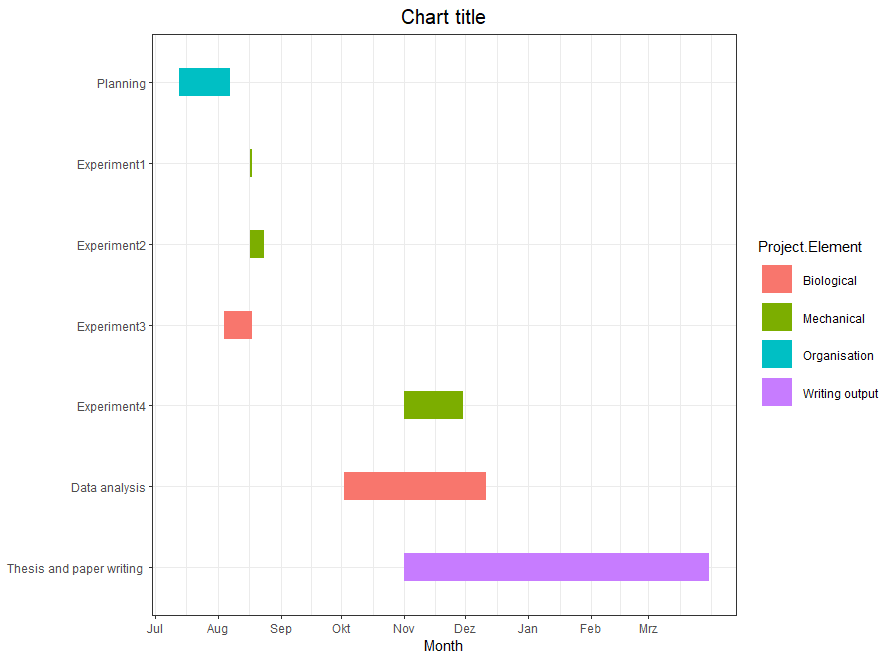

# Gantt-Chart
R code for creating visual Gantt chart for project management

Create a simple 5 column list of your activities and planned dates to complete them. 
Headings should be: "Item", "Activity", "Project.Element", "Start", "End". 

Dates should be in format: YYYY.MM.DD

Save as .csv 

Download the R code and run. 

Note that code for the chart itself was adapted from: https://www.molecularecologist.com/2019/01/03/simple-gantt-charts-in-r-with-ggplot2-and-the-tidyverse/

